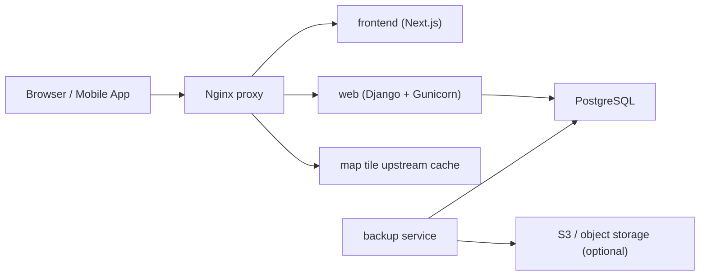

# EcoDesman: System And Deployment Map

## Репозитории

- `EcoDesman-server`:
  Django API, админка, backup jobs, production compose и nginx.
- `EcoDesman-web`:
  Next.js сайт и web-admin UI.
- `EcoDesman-mobile`:
  Flutter клиент, который потребляет тот же Django API.

## Production topology



## Входящие маршруты

| Host / path | Назначение | Target |
| --- | --- | --- |
| `SITE_DOMAIN /` | публичный сайт | `frontend:3000` |
| `SITE_DOMAIN /api/*` | same-origin API для сайта | `web:8000` |
| `SITE_DOMAIN /media/*` | media-файлы сайта | `web:8000` |
| `SITE_DOMAIN /static/*` | Django static | `web:8000` |
| `SITE_DOMAIN /django-admin/` | встроенная Django admin | `web:8000` |
| `API_DOMAIN /*` | прямой API-домен для мобильного клиента и сервисов | `web:8000` |
| `/map-data/*`, `/map-raster/*`, `/map-terrain/*` | tile proxy + cache | внешние upstream |

## Файлы деплоя

- `compose.yaml`:
  основной production стек `db + web + frontend + proxy + backup`.
- `deploy/nginx/default.conf.template`:
  ingress для `SITE_DOMAIN`, `API_DOMAIN` и IP fallback.
- `.env.production.example`:
  шаблон production env.
- `../deploy_econizhny_server.sh`:
  server bootstrap и `docker compose up --build -d`.

## Нормализованный deploy flow

1. На сервере лежат оба репозитория с точными именами:
   `~/EcoDesman-server` и `~/EcoDesman-web`.
2. В `~/EcoDesman-server/.env` задаются домены, секреты и storage settings.
3. `docker compose` внутри `EcoDesman-server` собирает backend и frontend из соседнего репозитория.
4. Nginx отдаёт сайт на `SITE_DOMAIN`, а API публикует и на `SITE_DOMAIN/api/*`, и на `API_DOMAIN/*`.
5. Frontend в production использует `/api/v1`, поэтому работает одинаково через домен сайта и через IP fallback.

## Ключевые переменные

| Переменная | Назначение |
| --- | --- |
| `SITE_DOMAIN` | публичный домен сайта |
| `API_DOMAIN` | отдельный домен API |
| `NEXT_PUBLIC_API_BASE_URL` | рекомендованно `/api/v1` |
| `DJANGO_ALLOWED_HOSTS` | backend host allowlist |
| `DJANGO_CSRF_TRUSTED_ORIGINS` | trusted origins для Django |
| `DJANGO_CORS_ALLOWED_ORIGINS` | origin allowlist для cross-origin клиентов |
| `WEB_PORT` | публичный порт nginx |
| `API_BIND_PORT` | локальный debug bind Django |
| `FRONTEND_BIND_PORT` | локальный debug bind Next.js |

## Проверка после выкладки

```bash
docker compose config
docker compose up --build -d
curl http://127.0.0.1:${WEB_PORT:-80}/api/v1/health/
curl http://127.0.0.1:${WEB_PORT:-80}/
```
